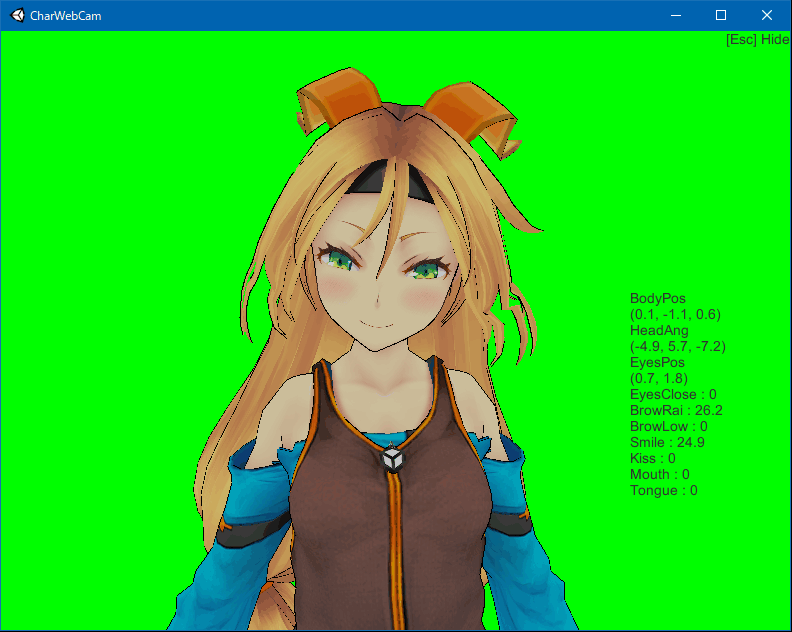
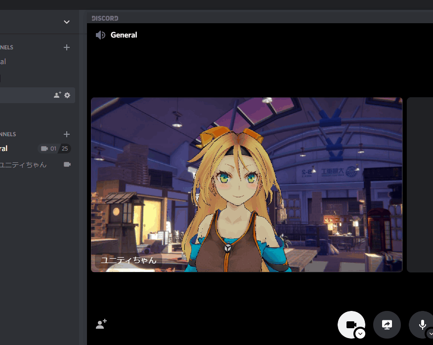

# CharWebCam
普通のWebCamで3Dキャラクター(Unityちゃん)を動かすよ！

VRMファイルがあれば、Unityちゃんの代わりに好きなアバターを動かすこともできます。

|||
|---|---|
|  |  |

## 動かすのに必要なもの
Intelの第4世代以降のCPU

## できること
カメラに映った顔から、キャラクターの位置、頭の向き、表情を反映できます。  
起動時に選択した録音デバイスの音量に合わせて口が動きます。  
マウスでカメラ操作ができます。

## 使い方
動画制作や配信等でクロマキー合成してお使いください。  
調整や拡張はご自由に行ってください。

## 表情の対応関係

| VRMBlendShape | フェイシャルキャプチャーで検出された表情 |
|---------------|------------------------------------------|
| Joy           | 笑顔                                     |
| Angry         | キス                                     |
| Sorrow        | 眉下                                     |
| `Surprise`    | 眉上                                     |

※ `Surprise` はVRMのプリセットにはないVRMBlendShapeです。

### コマンドライン引数
#### `--vrm`
読み込むVRMファイルを絶対パスで指定します。

##### 例
- `CharWebCam.exe "--vrm=C:\Users\charwebcam\Documents\unitychan (custom).vrm"`

#### `--audio-input-device`
起動時のマイクの選択を省略します。

##### 例
- `CharWebCam.exe --audio-input-device`
	+ 既定のデバイスを選択します。 
- `CharWebCam.exe "--audio-input-device=マイク (Realtek Audio)"`
	+ 「マイク (Realtek Audio)」を選択します。

#### `--display-raw-camera-image`
ウィンドウ右下へ、カメラの映像をそのまま表示します。

#### `--hide-text-default`
ウィンドウ内のテキストをデフォルトで非表示にします。  
`--audio-input-device` の指定がない場合は、マイク入力なしとなります。  
この指定を行うと、`--display-raw-camera-image` は無視されます。

## 注意
カメラの初期化はRealSenseSDK任せなので、認識させたいカメラのみPCに接続してください。  
**※RealSenseSDKは、dllの絶対パスにASCII外の文字が含まれていると動作しません。絶対パスがASCIIのみで構成させている場所へUnityプロジェクトを置いてください。**

## ライセンス
MIT  
Copyright (c) 2020 120  
※以下の部分を除く

### Packages/VRM Packages/VRM Shaders
MIT
Copyright (c) 2020 VRM Consortium
Copyright (c) 2018 Masataka SUMI for MToon  
https://github.com/vrm-c/UniVRM/blob/v0.56.0/LICENSE.txt

### Assets/VRMLoaderUI Assets/StreamingAssets/VRMLoaderUI
MIT  
Copyright (c) 2018 m2wasabi  
https://github.com/m2wasabi/VRMLoaderUI/blob/0.3/LICENSE

### Assets/VRMViewer/Scripts/FileDialogForWindows.cs
MIT
Copyright (c) 2018 dwango  
https://github.com/vrm-c/UniVRMTest/blob/VRMViewer_v1.05/LICENSE.txt

### Assets/RSSDK
Intel RealSense SDK License October 2015 Version  
https://software.intel.com/content/dam/develop/external/us/en/documents/intel-realsense-sdk-license-843462.pdf

### DefaultModel/unitychan.vrm Assets/UnityChan/WAIT00.anim readme-sample1.png readme-sample2.png
© Unity Technologies Japan/UCL  
https://unity-chan.com/contents/guideline/

## 免責
ご利用は自己責任で！！  
特にMMDモデルのご利用はMMD4Mの注意事項およびモデル付属の文書をよく読みましょう。  
そして版権モデルの場合は版権元の規約も読みましょう。

## VRM版
以下のページから「CharWebCam.zip」をダウンロード  
https://github.com/xelloss120/CharWebCam/releases  
**※保存先のパスに全角が混ざるとダメなので、半角英数記号のみで構成される保存先(パス)に置いて実行してください。**

## 旧ユニティちゃん版
https://1drv.ms/u/s!Ass7Jg1DXnrDlBoBFcokzBZX2Tm9  

## 旧プロ生ちゃん版
https://1drv.ms/u/s!Ass7Jg1DXnrDmR83V47_raOXKTUj  
